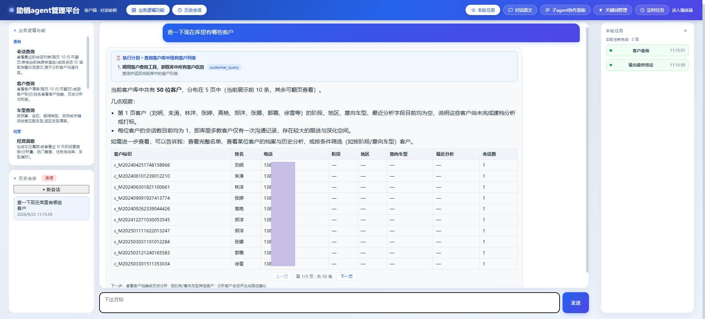
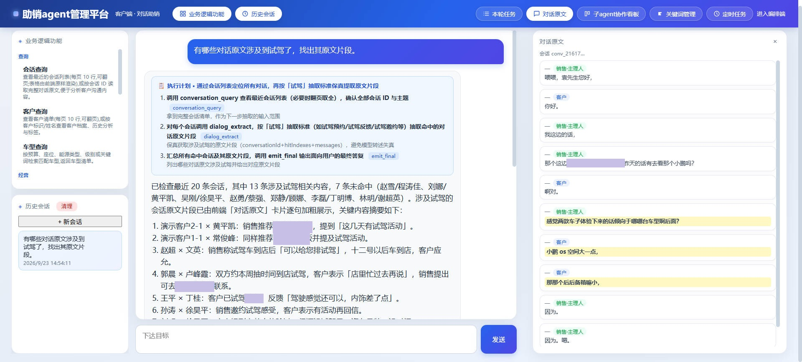
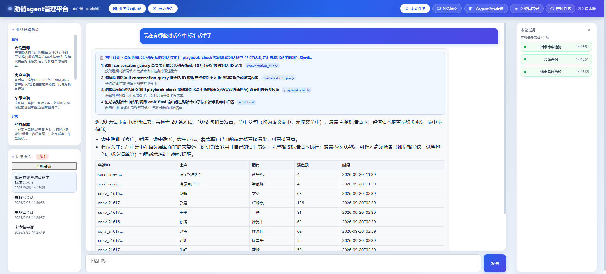
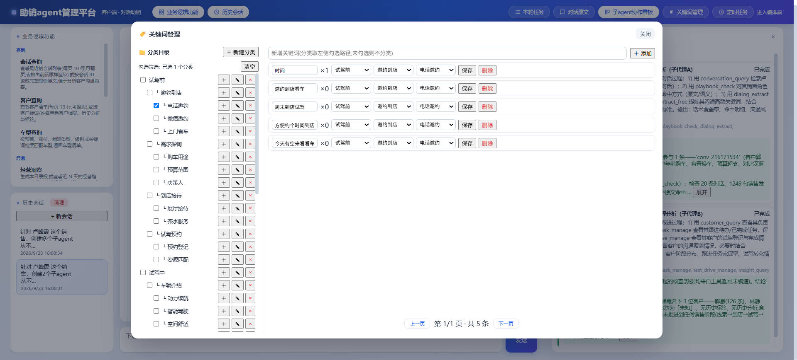
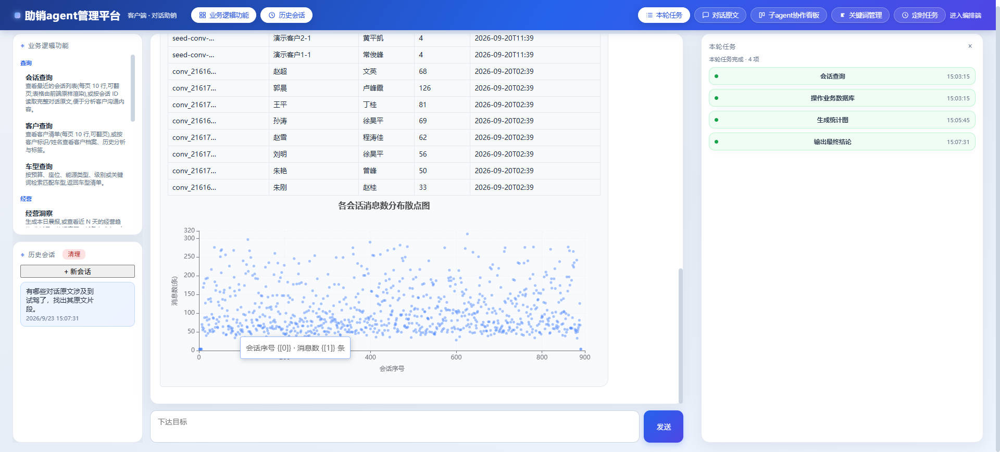
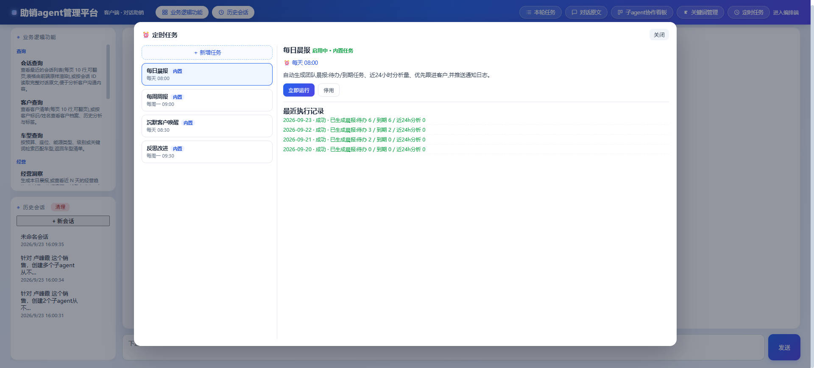
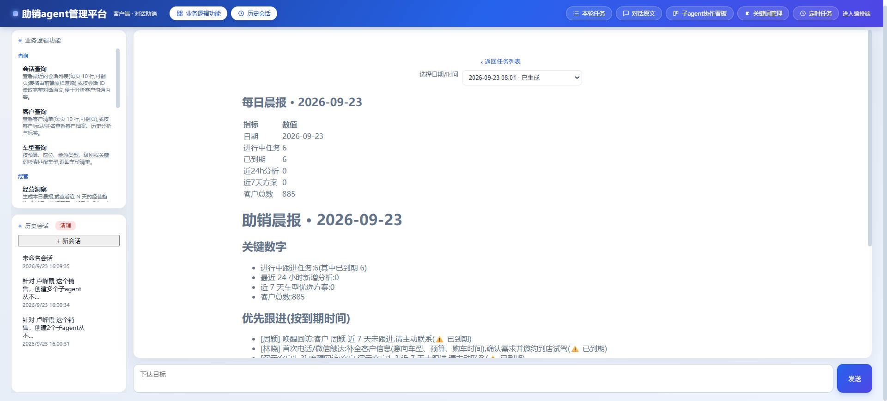

# 助销agent管理平台


面向销售团队的助销agent管理平台，以客户会话记录为基础，自动检索团队话术库、识别意向与风险、给出可复制的应对话术与跟进建议，并形成自动闭环。


# 界面截图
















# 技术栈

- Node.js >= 24(`node:sqlite`) + TypeScript + Fastify + Vitest
- [pi(0.84.1, earendil-works)](https://github.com/earendil-works/pi)agent 运行时的本地 workspace 构建
- SQLite:FTS5 trigram 中文检索、多租户隔离、分析落库
- 模型，OpenAI 兼容端点(配置驱动);测试用 pi 内置 faux 模型做离线端到端

# 配置

所有运行时配置集中在仓库顶层 **[help-sale.config.yaml](help-sale.config.yaml)**，YAML 格式，**支持 # 注释**，每个字段都写明了作用;覆盖，服务监听、数据目录、默认租户、模型端点/模型名/密钥/代理/上下文窗口(含 `model.extraBody` —— 额外模型参数会统一放进请求体 `extra_body` 字段，不与标准参数平级)、知识分块参数、检索条数、公司与团队名称。

配置只从该文件读取，不支持环境变量覆盖;唯一例外是 `CONFIG_PATH` 用于指定其他配置文件路径。

# 快速开始

```bash
npm ci --prefix pi --ignore-scripts
node scripts/gen-minimal-model-data.mjs        # 离线模型数据(models.dev 不可达时)
npm run build:offline --prefix pi
npm install --ignore-scripts                    # 根 workspace 链接 pi 包
npm test                                        # 253 tests
npm run typecheck
```

开发服务，

```bash
npm run dev                                     # 监听 help-sale.config.yaml 中的 host:port
```

# 中间件(可选)

- **MySQL**(连接信息在 help-sale.config.yaml mysql 段，按部署环境填入凭据):分析(analyses)与车型优选方案(vehicle_match_plans)自动归档，失败自动降级不影响主流程;可用于后续报表/BI。
- **Redis**(连接信息在 help-sale.config.yaml redis 段，按部署环境填入凭据):跟进任务到期提醒队列，前端可查询已到期待办并显示「已到期」标记，完成即出队。
- 连接信息与开关都在 help-sale.config.yaml(mysql/redis 段),按部署环境填入凭据;`enabled: false` 关闭(Redis 自动退化为内存队列)。


# 工具实现

平台的工具分「业务级」和「系统级」两层：业务级工具直接对销售场景，系统级工具提供通用能力，业务工具由系统工具组合而成。

## 业务级工具

### 查询相关

| 工具 | 用途 | 典型场景 |
| --- | --- | --- |
| conversation_query | 查看会话列表、读取完整对话原文（支持翻页） | 查某客户/某销售的近期沟通记录 |
| customer_query | 客户清单、档案、历史、标签（支持按姓名解析） | 了解客户背景、跟进状态、意向车型 |
| vehicle_query | 车型检索 | 按预算/座位/能源/级别找合适车型 |

### 话术与知识

- **knowledge_search — 话术/知识库检索**
  一句话：在团队沉淀的话术、政策、竞品资料里搜索相关内容。
  关键机制：知识入库时自动分块（默认 600 字/块、80 字重叠），SQLite FTS5 trigram 全文索引实时同步；检索走「长词全文匹配 + 短词模糊匹配 + 无命中整句兜底」，中文不用分词就能搜到品牌名、话术短语。

- **knowledge_ingest / knowledge_candidate — 话术沉淀与审批**
  一句话：把值得沉淀的话术写进知识库，并经过「二次确认 + 审批」防止误入库。
  流程：发现值得沉淀的内容 → 生成候选（建议新增/覆盖/跳过）→ 后台检索比对（FTS + 语义相似度：低于 0.45 建议新增、0.45~0.9 建议覆盖、高于 0.9 建议跳过）→ 人工/模型审批后落库或拒绝。

- **playbook_check — 话术命中检测**
  一句话：检查某销售的对话是否按标准话术沟通、命中率如何。
  流程：取某销售最近 N 条对话的销售发言 → 与话术库做「原文命中 + 语义命中」双通道匹配 → 输出命中明细（客户/销售/命中话术/方式/相似度）与覆盖率；语义匹配按 20 句一组批量计算，控制耗时。

### 任务与销售流程

- **task_manage — 跟进任务**
  一句话：创建、查看、完成跟进任务，到期的自动提醒。
  任务来源：主 agent 主动创建、会话分析自动生成、试驾完成后自动生成（24h/3天/7天回访）、成交后自动生成（3天提车关怀/30天保养邀约）。到期任务进入提醒队列（Redis，前端显示「已到期」）。

- **test_drive_manage — 试驾管理**
  一句话：登记、完成、取消试驾，完成自动生成回访节奏。
  流程：登记试驾（客户自动进入试驾阶段）→ 完成并记录反馈 → 自动生成 24h/3天/7天三段回访任务；取消则不生成。

### 经营洞察

- **insight_query — 每日晨报 / 经营趋势**
  一句话：一键生成团队晨报和经营趋势。
  晨报内容：进行中/到期任务、近 24h 分析量、热门客户意图、优先跟进清单；趋势看板：分析量、意图分布、任务完成率、车型品牌偏好。

## 系统级工具

### 多代理协作

- **subagents / kanban — 子代理并行 + 协作看板**
  一句话：大任务拆成多个子代理并行执行，结果写回看板，主代理监督并汇总。
  特点：主代理按任务复杂度决定是否拆分；子代理按白名单加载工具、不可再派生；看板按会话隔离；主代理在等待期内检查子代理心跳，卡死的子任务会自动结束。

### 文件与数据

- **file_read / file_write_new** — 任意路径读取文件；只允许写入新文件（不覆盖现有文件）
- **txt / excel / ppt** — 读取仓库内文本、Excel、PPT 数据
- **sql** — 业务库操作（默认只读，危险语句拦截 + 审计）
- **redis** — Redis 白名单操作

### 算法与呈现

- **embedding / similarity / cluster** — 本地轻量中文向量模型，提供文本语义相似度与聚类
- **keyword_extract_free / keyword_extract_strict** — 关键词挖掘：自由模式参考词库由 LLM 挖掘去重入库；严格模式按「切片 → 相似度预筛 → LLM 抽取 → 候选校验」回写词库
- **dialog_extract** — 按抽取标准从对话中保真抽取片段：模型只返回句子序号，工具按序号从原文取内容，前端对命中句加粗
- **table_generate / chart_generate** — 生成表格、流程图、统计图（结果由前端直接渲染）
- **computer / date_tool / browser** — 计算、日期转换、HTTP 抓取
- **update_memory** — 更新系统记忆（memory.md，拼入系统提示词），沉淀用户偏好与运行经验
