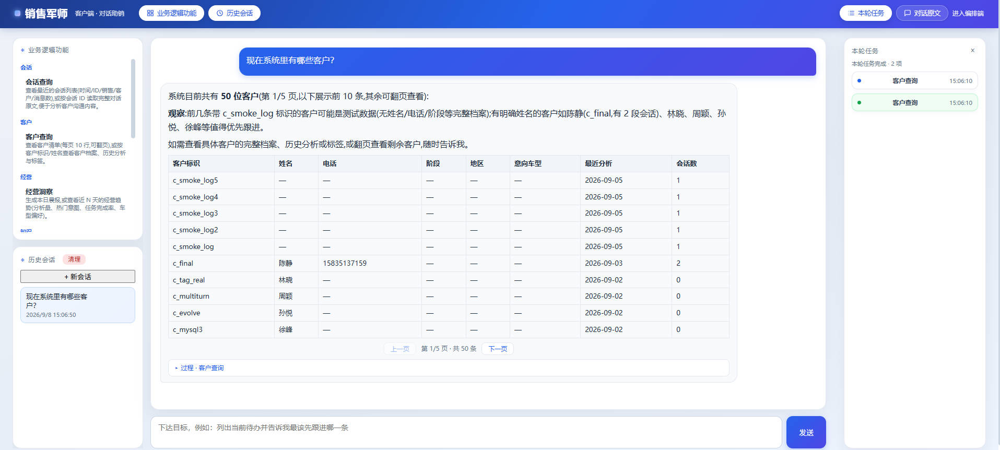
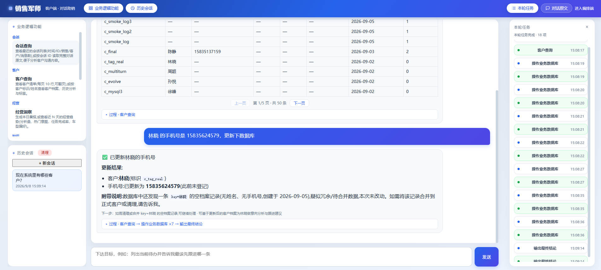
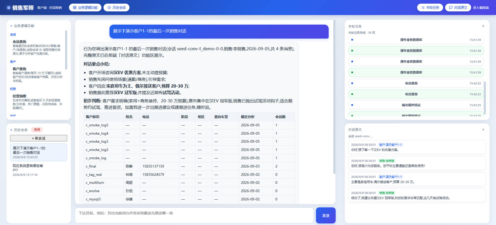

# 助销 Agent — 销售军师(Sales Copilot)

面向销售团队的 AI 助销 Agent:粘贴一段客户沟通记录,自动检索团队话术库、识别意向与风险、给出可复制的应对话术与跟进建议,并沉淀为团队知识资产,形成「会话分析 → 话术沉淀 → 跟进任务 → 经营洞察」的闭环。

## 功能亮点

- **对话分析**:录入会话原文,自动识别客户意图(价格异议/需求确认/竞品对比等)、提取关键信号与客户原话,生成可复制的应对话术与跟进建议。
- **话术知识库**:话术/政策/竞品资料批量沉淀,自动分块与去重;FTS5 trigram 中文检索;分析自动生成话术候选,人工确认后入库。
- **客户跟进**:按客户标识或姓名查询档案/历史/标签,创建带截止时间的跟进任务,到期提醒。
- **经营洞察**:每日晨报(待办/到期/近24h分析)与近 N 天趋势(分析量/热门意图/任务完成率/车型偏好)。
- **车型优选**:按预算/座位/能源/级别检索车型库,生成推荐方案。
- **业务工具分层**:系统级原语(sql/文件/表格/向量/聚类/关键词/对话处理)+ 业务级聚合工具(客户/会话/知识/任务/车型/经营),工具结果由前端功能区原样展示、可追溯、可翻页。
- **本地优先**:默认 SQLite 单一主库,可选远程 MySQL;支持多租户隔离;模型输入输出本地日志。

## 界面截图







## 技术栈

- Node.js >= 24(`node:sqlite`) + TypeScript + Fastify + Vitest
- [pi(0.84.1, earendil-works)](https://github.com/earendil-works/pi) agent 运行时(local workspace 构建)
- SQLite:FTS5 trigram 中文检索、多租户隔离、分析落库
- 模型:OpenAI 兼容端点(本地/内网网关均可),测试用 pi 内置 faux 模型做离线端到端

## 快速开始

```bash
# 1. 配置
cp help-sale.config.example.yaml help-sale.config.yaml   # 填写模型端点/密钥(见文件内 * 标记)

# 2. 安装依赖并构建 agent 运行时
npm ci --prefix pi --ignore-scripts
node scripts/gen-minimal-model-data.mjs   # 离线模型数据(models.dev 不可达时)
npm run build:offline --prefix pi
npm install --ignore-scripts

# 3. 测试与类型检查
npm test          # 全量测试
npm run typecheck

# 4. 启动服务(默认 0.0.0.0:3101,由 help-sale.config.yaml 控制)
npm run dev
```

## 配置

所有运行时配置集中在 `help-sale.config.yaml`(仓库只提供匿名示例 `help-sale.config.example.yaml`)。覆盖:服务监听、数据存储模式(local/mysql)、默认租户、模型端点/模型名/密钥/代理、知识分块参数、检索条数、日志、业务默认值、可选中间件(MySQL/Redis/通知 Webhook)、公司与团队名称。

> 部署时复制 `help-sale.config.example.yaml` 为 `help-sale.config.yaml`,在文件内填入当前环境的模型密钥与数据库凭据即可运行。

## 目录结构

```
apps/api/            # Fastify 服务:路由/仓库/服务/agent 编排(pi)/提示词/数据库
tools/               # 业务级工具(9 个聚合工具:客户/会话/知识/任务/车型/经营)
tools_system/        # 系统级工具原语(sql/文件/表格/向量/聚类/关键词/对话/记忆/协作)
docs/tools/          # 业务工具梳理与重组设计
docs/images/         # 界面截图
scripts/             # 构建/数据生成脚本
help-sale.config.example.yaml  # 配置模板
```

## 工具清单

业务级:`customer_query`(客户)、`conversation_query`(会话)、`knowledge_search`(话术检索)、`knowledge_ingest`(话术沉淀)、`knowledge_candidate`(话术候选)、`task_manage`(跟进任务)、`vehicle_query`(车型)、`insight_query`(经营洞察)。

系统级:`sql`、`redis`、`kanban`、`subagents`、`table_generate`、`file_read`、`file_write_new`、`txt`、`excel`、`ppt`、`browser`、`computer`、`update_memory`、`todo_list`、`embedding`、`cluster`、`keyword_extract_free`、`keyword_extract_strict`、`dialog_extract`、`dialog_select`、`date_tool`。

工具说明见 [docs/tools/business-tools-reorg.md](docs/tools/business-tools-reorg.md)。

## API 概览

| 方法 | 路径 | 说明 |
| --- | --- | --- |
| GET | /api/v1/health | 健康检查 |
| POST | /api/v1/agent/run | Agent 单轮执行(goal) |
| POST | /api/v1/agent/threads/:id/run-stream | Agent 流式执行(SSE/NDJSON) |
| GET | /api/v1/agent/capabilities | 业务工具能力清单 |
| POST | /api/v1/copilot/analyze | 会话分析 + 落库 |
| POST | /api/v1/copilot/evaluate-response | 话术评估 |
| POST | /api/v1/copilot/voice-digest | 通话/试驾文字稿总结 |
| POST | /api/v1/copilot/vehicle-match | 车型优选 |
| GET/POST | /api/v1/knowledge* | 知识库检索/沉淀/候选 |
| GET/POST | /api/v1/tasks | 跟进任务 |
| GET | /api/v1/stores/:id/overview | 门店经营概况 |
| GET | /api/v1/conversations/:id/transcript | 对话原文 |

请求头 `x-tenant-id` 指定租户(默认 `t_demo`)。

## 测试

`npm test` 全量(约 190+ 用例):仓库层/服务层/Agent 编排/工具/前端页面冒烟,均离线运行(pi faux 模型)。